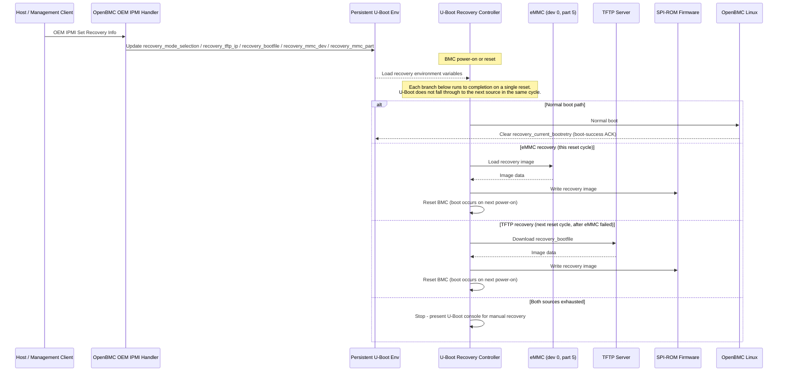
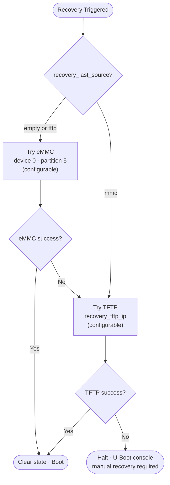

# BMC Firmware Auto-Recovery

## Summary

This design provides automatic BMC firmware recovery for single-image OpenBMC
systems. When the primary SPI-ROM firmware repeatedly fails to boot, or an
operator explicitly requests recovery, U-Boot restores a known-good image from
an eMMC recovery partition. If the eMMC recovery source is unavailable or
fails, U-Boot falls back to retrieving the recovery image over TFTP.

## Background

This design adds an automatic recovery mechanism to U-Boot that:

1. Detects repeated boot failures and avoids unnecessary reflashing for one-time faults.
2. Restores the firmware from a known-good backup stored on eMMC - no physical access needed.
3. Falls back to downloading a recovery image over the network (TFTP) if the eMMC backup is unavailable.
4. Stops and waits for manual flashing only when both sources fail.

## Requirements

- Detect repeated failed boot attempts in U-Boot.
- Recover first from a configurable eMMC device and partition (default device 0, partition 5).
- Fall back to configurable TFTP when eMMC recovery is exhausted or unavailable.
- Retry source operations using a configurable retry limit.
- Expose the supported recovery configuration, including the eMMC device/partition, through an OEM IPMI command (refer to the OEM IPMI Interface section).

## Architecture

The feature is implemented primarily in the board-specific U-Boot environment. U-Boot owns boot-attempt accounting, source selection, image
transfer, SPI-ROM programming and reset.

The OpenBMC userspace is responsible only for confirming a successful normal
boot. On successful boot, it clears the boot-retry state through the existing
platform mechanism used to update U-Boot environment state. The OEM IPMI
handler updates the supported recovery environment variables via fw_setenv.

## Recovery Image and Storage

The local recovery image resides on eMMC device 0, partition 5 (formatted as ext4).
The recovery image filename is configurable via recovery_bootfile (default filename
obmc-phosphor-image-evb-ast2600.static.mtd), is used by both eMMC and TFTP
recovery, and is configurable at runtime (refer to the OEM IPMI Interface
section).

### Image Consistency Requirements

- For all images used (eMMC recovery and TFTP recovery sources), the U-Boot environment size must be identical.
- The start offset of the U-Boot environment must be the same across all images.
- This consistency ensures reliable recovery behavior when switching between recovery sources and avoids configuration conflicts.

## Configuration

All values are persistent U-Boot environment variables.

| Variable | Default value | Allowed values | Description | Variable Change Option |
| --- | --- | --- | --- | --- |
| recovery_retry | 3 | Positive integer | Maximum attempts per recovery source. | Build-time (CONFIG_RECOVERY_RETRY) |
| recovery_last_source | none | none, mmc, or tftp | Last recovery source in the current recovery sequence. | U-Boot runtime (env set) |
| recovery_max_bootretry | 3 | Non-negative integer | Failed normal boot attempts allowed before automatic recovery starts. | Build-time (CONFIG_RECOVERY_MAX_BOOTRETRY) |
| recovery_current_bootretry | 0 | Non-negative integer | Persistent normal-boot attempt counter. | U-Boot runtime (env set) |
| recovery_mmc_dev | 0 | 0, 1, or 2 (hardware/vendor-defined) | eMMC device index containing the recovery image. | Build-time (CONFIG_RECOVERY_MMC_DEV); OEM IPMI |
| recovery_mmc_part | 5 | Platform/vendor-defined partition number | eMMC partition containing the recovery image. | Build-time (CONFIG_RECOVERY_MMC_PART); OEM IPMI |
| recovery_bootfile | obmc-phosphor-image-evb-ast2600.static.mtd | 1–42 ASCII bytes, no embedded NUL | Recovery image filename used by both eMMC and TFTP sources. | OEM IPMI |
| recovery_tftp_ip | 0.0.0.0 (unconfigured) | Valid IPv4 address | TFTP server address used for network recovery. | OEM IPMI |
| recovery_mode_selection | auto | auto, mmc, or tftp | Recovery source override: auto uses the default source-selection logic; mmc forces eMMC only; tftp forces TFTP only. | OEM IPMI |

Values marked OEM IPMI are configurable at runtime via the OEM IPMI Set Recovery
Info command; refer to the OEM IPMI Interface section.

## Boot and Recovery Behavior

### Normal boot accounting

1. At reset, U-Boot checks recovery_mode_selection and compares
   recovery_current_bootretry to recovery_max_bootretry.
2. If neither condition requires recovery, U-Boot increments
   recovery_current_bootretry and starts the normal boot.
3. Once Linux reaches the platform-defined boot-success point, OpenBMC clears
   recovery_current_bootretry and recovery transient state.
4. If the system resets before boot success, the counter remains incremented.
   U-Boot enters recovery when the configured limit is exceeded.

### Source selection

The controller prefers eMMC unless recovery_last_source indicates that TFTP
was the last successful source for the active recovery sequence:

### eMMC recovery

For up to recovery_retry attempts, U-Boot:

1. Sets recovery_last_source=mmc.
2. Initializes recovery_mmc_dev and selects recovery_mmc_part.
3. Loads the recovery image (recovery_bootfile) from eMMC to RAM.
4. Writes the primary SPI-ROM firmware region.
5. Resets the BMC.

An exhausted retry count, image-load failure, flash write failure, or failed
post-recovery boot transfers control to TFTP recovery.

### TFTP recovery

TFTP recovery requires a configured recovery_tftp_ip and network
configuration obtained through DHCP.
For up to recovery_retry attempts, U-Boot:

1. Sets recovery_last_source=tftp.
2. Obtains network configuration.
3. Downloads recovery_bootfile from recovery_tftp_ip to RAM.
4. Writes the primary SPI-ROM firmware region.
5. Resets the BMC.

If the TFTP server is not configured or all attempts fail, U-Boot stops
automatic recovery and presents the console for manual flashing.

## OEM IPMI Interface

Available only when the platform image enables firmware auto-recovery support.

Set Recovery Info - NetFn 0x32, Command 0xFA

Request: [Selector] [0x00] [Data...]

| Selector | Parameter | Data |
| --- | --- | --- |
| 0x01 | TFTP server IP | 4 bytes, network byte order |
| 0x02 | TFTP recovery filename | 1–42 ASCII bytes, no embedded NUL |
| 0x03 | Recovery mode selection | 1 byte: 0x00 = auto, 0x01 = mmc, 0x02 = tftp |
| 0x04 | eMMC device and partition | 2 bytes: [recovery_mmc_dev] [recovery_mmc_part] |

Invalid selectors, wrong payload lengths, or bad values are rejected with an IPMI error completion code.

Get Recovery Info - NetFn 0x32, Command 0xFB

Request: [Selector] [0x00]

The request has no data bytes: byte 1 is the selector (same selector values as
Set Recovery Info), byte 2 is the block selector and must be 0x00.

| Selector | Parameter | Response Data | Example |
| --- | --- | --- | --- |
| 0x01 | TFTP server IP | 4 bytes, network byte order | 172.31.201.40 (172=0xAC, 31=0x1F, 201=0xC9, 40=0x28) returns AC 1F C9 28 |
| 0x02 | Recovery image filename | 1–42 ASCII bytes, no embedded NUL | ami-ocp.mtd returns 61 6D 69 2D 6F 63 70 2E 6D 74 64 |
| 0x03 | Recovery mode selection | 1 byte: 0x00 = auto, 0x01 = mmc, 0x02 = tftp | mode tftp returns 02 |
| 0x04 | eMMC device and partition | 2 bytes: [recovery_mmc_dev] [recovery_mmc_part] | dev 0, part 5 returns 00 05 |

### Example Commands (Set and Get)

Replace <bmc-ip> and <password> with the target BMC address and credentials.

Selector 0x01 - TFTP server IP (example value 172.31.201.40):
Set: ipmitool -I lanplus -H <bmc-ip> -U root -P <password> raw 0x32 0xfa 0x01 0x00 0xAC 0x1F 0xC9 0x28
Get: ipmitool -I lanplus -H <bmc-ip> -U root -P <password> raw 0x32 0xfb 0x01 0x00
     -> returns AC 1F C9 28

Selector 0x02 - Recovery image filename (example value ami-ocp.mtd):
Set: ipmitool -I lanplus -H <bmc-ip> -U root -P <password> raw 0x32 0xfa 0x02 0x00 0x61 0x6D 0x69 0x2D 0x6F 0x63 0x70 0x2E 0x6D 0x74 0x64
Get: ipmitool -I lanplus -H <bmc-ip> -U root -P <password> raw 0x32 0xfb 0x02 0x00
     -> returns 61 6D 69 2D 6F 63 70 2E 6D 74 64

Selector 0x03 - Recovery mode selection (example value tftp = 0x02):
Set: ipmitool -I lanplus -H <bmc-ip> -U root -P <password> raw 0x32 0xfa 0x03 0x00 0x02
Get: ipmitool -I lanplus -H <bmc-ip> -U root -P <password> raw 0x32 0xfb 0x03 0x00
     -> returns 02

Selector 0x04 - eMMC device and partition (example value dev 0, part 5):
Set: ipmitool -I lanplus -H <bmc-ip> -U root -P <password> raw 0x32 0xfa 0x04 0x00 0x00 0x05
Get: ipmitool -I lanplus -H <bmc-ip> -U root -P <password> raw 0x32 0xfb 0x04 0x00
     -> returns 00 05

Invalid selectors or a non-zero block selector are rejected with an IPMI error completion code.

## Error Handling and Observability

- U-Boot must print the selected source, retry number, SPI-ROM write result and fallback decision to the serial console.
- Failed eMMC recovery must print the failure state and fall through to TFTP recovery.
- Failed TFTP recovery must print the failure state and request manual flashing.
- recovery_last_source is updated on entry to the active recovery source (eMMC or TFTP).
- A successful normal OpenBMC boot resets recovery_current_bootretry.
  recovery_last_source is not cleared automatically and persists until the
  next recovery attempt updates it.
- When both sources fail, the final console message must state that automatic
  recovery is exhausted and that manual U-Boot flashing is required.

## Validation Plan

- **Normal boot completes** - Boot normally past the boot-success acknowledgement point; retry count is cleared and recovery is not entered.
- **Boot failures exceed threshold** - Interrupt boot until recovery_current_bootretry exceeds recovery_max_bootretry; eMMC recovery starts automatically.
- **Valid eMMC recovery image** - Place a valid image on eMMC device 0, partition 5 and trigger recovery; SPI-ROM is programmed and BMC resets successfully.
- **Missing or invalid eMMC image** - Corrupt or remove the eMMC image and trigger recovery; the eMMC attempt fails and halts, then TFTP recovery starts on the next BMC reset.
- **Valid TFTP recovery image** - Serve a valid image from the TFTP server with eMMC unavailable; SPI-ROM is programmed and BMC resets successfully.
- **TFTP unavailable or image invalid** - Make TFTP unreachable or serve a corrupt image with eMMC unavailable; automatic recovery stops and U-Boot presents the console.
- **Recovery mode** - Set recovery_mode_selection via OEM IPMI to force a specific source (mmc or tftp); once boot retries exceed recovery_max_bootretry, recovery uses the forced source instead of the default auto selection logic.
- **Invalid OEM IPMI payload** - Send Set Recovery Info with a bad selector, wrong length, or invalid value; command returns an error and prior configuration is unchanged.
