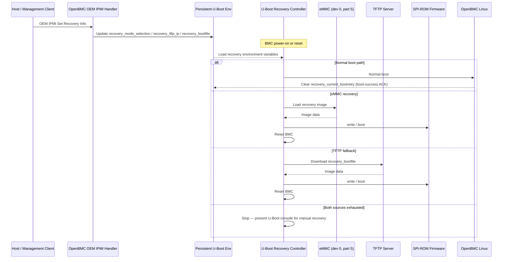
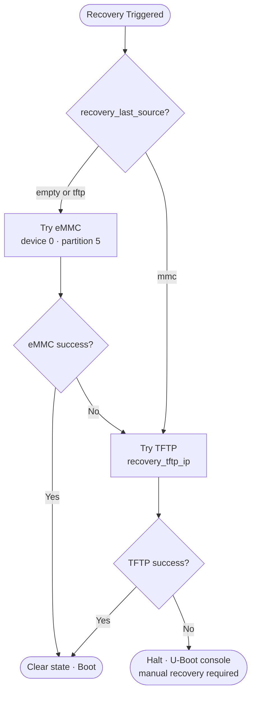

# BMC Firmware Auto-Recovery

**Target:** OpenBMC - EVB-AST2600   
**Last updated:** 2026-09-04

## Summary

This design provides automatic BMC firmware recovery for single-image OpenBMC
systems. When the normal SPI-ROM firmware cannot boot repeatedly, or an
operator explicitly requests recovery, U-Boot restores a known-good image from
an eMMC recovery partition. If local recovery is unavailable or fails, U-Boot
can obtain the recovery image through TFTP.

## Background

This design adds an **automatic recovery mechanism** to U-Boot that:

1. Detects repeated boot failures and avoids unnecessary reflashing for one-time faults
2. Restores the firmware from a known-good backup stored on eMMC — no physical access needed
3. Falls back to downloading a recovery image over the network (TFTP) if the eMMC backup is unavailable
4. Stops and waits for manual flashing only when both sources fail

## Requirements

- Detect repeated failed boot attempts in U-Boot.
- Configurable recover first from eMMC device `0`, partition `5`.
- Fall back to configurable TFTP when eMMC recovery is exhausted or unavailable.
- Retry source operations using a configurable retry limit.
- Expose the supported recovery configuration through an OEM IPMI command.

## Architecture

The feature is implemented primarily in the board-specific U-Boot environment. U-Boot owns boot-attempt accounting, source selection, image
transfer, SPI-ROM programming and reset.

The OpenBMC userspace is responsible only for confirming a successful normal
boot. On successful boot, it clears the boot-retry state through the existing
platform mechanism used to update U-Boot environment state. The OEM IPMI
handler updates the supported recovery environment variables.



## Recovery Image and Storage

The local recovery image resides on eMMC device `0`, partition `5` (formatted as ext4). The
recovery image filename is configurable via `recovery_bootfile`.

```text
obmc-phosphor-image-evb-ast2600.static.mtd
```

The configurable `recovery_bootfile` is used by both eMMC and TFTP recovery.

**Image Consistency Requirements:**
- For all images used (eMMC recovery and TFTP recovery sources), the U-Boot environment size must be identical
- The start offset of the U-Boot environment must be the same across all images
- This consistency ensures reliable recovery behavior when switching between recovery sources and avoids configuration conflicts

## Configuration

All values are persistent U-Boot environment variables.

| Variable | Default / expected value | Description | Variable Change Option |
| --- | --- | --- | --- |
| `recovery_retry` | Platform-defined positive integer | Maximum attempts per recovery source. | Build-time (`CONFIG_EXTRA_ENV_SETTINGS`) |
| `recovery_last_source` | Empty, `mmc`, or `tftp` | Last recovery source in the current recovery sequence. | U-Boot runtime (`env set`) |
| `recovery_max_bootretry` | Platform-defined non-negative integer | Failed normal boot attempts allowed before automatic recovery starts. | Build-time (`CONFIG_EXTRA_ENV_SETTINGS`) |
| `recovery_current_bootretry` | `0` | Persistent normal-boot attempt counter. | U-Boot runtime (`env set`) |
| `recovery_mmc_dev` | `0` | eMMC device index containing the recovery image. | Build-time (`CONFIG_EXTRA_ENV_SETTINGS`) |
| `recovery_mmc_part` | `5` | eMMC partition containing the recovery image. | Build-time (`CONFIG_EXTRA_ENV_SETTINGS`) |
| `recovery_bootfile` | `obmc-phosphor-image-evb-ast2600.static.mtd` | Recovery image filename used by both eMMC and TFTP sources. | OEM IPMI (selector `0x02`) |
| `recovery_tftp_ip` | Platform-provisioned IPv4 address | TFTP server address used for network recovery. | OEM IPMI (selector `0x01`) |
| `recovery_mode_selection` | `auto` | Recovery source override: `auto` uses the default source-selection logic; `mmc` forces eMMC only; `tftp` forces TFTP only. | OEM IPMI (selector `0x03`) |

## Boot and Recovery Behavior

### Normal boot accounting

1. At reset, U-Boot checks `recovery_mode_selection` and compares
   `recovery_current_bootretry` to `recovery_max_bootretry`.
2. If neither condition requires recovery, U-Boot increments
   `recovery_current_bootretry` and starts the normal boot.
3. Once Linux reaches the platform-defined boot-success point, OpenBMC clears
   `recovery_current_bootretry` and recovery transient state.
4. If the system resets before boot success, the counter remains incremented.
   U-Boot enters recovery when the configured limit is exceeded.

### Source selection

The controller prefers eMMC unless `recovery_last_source` indicates that TFTP
was the last successful source for the active recovery sequence:



### eMMC recovery

For up to `recovery_retry` attempts, U-Boot:

1. sets `recovery_last_source=mmc`.
2. Initializes `recovery_mmc_dev` and selects `recovery_mmc_part`.
2. Loads the recovery image (`recovery_bootfile`) from eMMC to RAM.
3. Writes the primary SPI-ROM firmware region.
4. Resets the BMC.

An exhausted retry count, image-load failure, validation failure, flash write
failure, or failed post-recovery boot transfers control to TFTP recovery.

### TFTP recovery

TFTP recovery requires a configured `recovery_tftp_ip` and network
configuration obtained through DHCP or board-defined static U-Boot networking.
For up to `recovery_retry` attempts, U-Boot:

1. Sets `recovery_last_source=tftp`
2. Obtains network configuration.
3. Downloads `recovery_bootfile` from `recovery_tftp_ip` to RAM.
4. Writes the primary SPI-ROM firmware region.
5. Resets the BMC.

If the TFTP server is not configured or all attempts fail, U-Boot stops
automatic recovery and presents the console for manual flashing.

## OEM IPMI Interface

Available only when the platform image enables firmware auto-recovery support.

**Set Recovery Info** — NetFn `0x32`, Command `0xFA`

Request: `[Selector] [0x00] [Data...]`

| Selector | Parameter | Data |
| --- | --- | --- |
| `0x01` | TFTP server IP | 4 bytes, network byte order |
| `0x02` | TFTP recovery filename | 1–42 ASCII bytes, no embedded NUL |
| `0x03` | Recovery mode selection | 1 byte: `0x00` = `auto`, `0x01` = `mmc`, `0x02` = `tftp` |

Invalid selectors, wrong payload lengths, or bad values are rejected with an IPMI error completion code.

## Error Handling and Observability

- U-Boot must print the selected source, retry number, SPI-ROM write result and fallback decision to the serial console.
- Failed eMMC recovery must print the failure state and fall through to TFTP recovery.
- Failed TFTP recovery must print the failure state and request manual flashing.
- `recovery_last_source` is updated after enter to the active recovery source (eMMC or TFTP).
- A successful normal OpenBMC boot resets `recovery_current_bootretry` and
  clears stale recovery state.
- When both sources fail, the final console message must state that automatic
  recovery is exhausted and that manual U-Boot flashing is required.

## Validation Plan

- **Normal boot completes** — Boot normally past the boot-success acknowledgement point; retry count is cleared and recovery is not entered.
- **Boot failures exceed threshold** — Interrupt boot until `recovery_current_bootretry` exceeds `recovery_max_bootretry`; eMMC recovery starts automatically.
- **Valid eMMC recovery image** — Place a valid image on eMMC device `0`, partition `5` and trigger recovery; SPI-ROM is programmed and BMC resets successfully.
- **Missing or invalid eMMC image** — Corrupt or remove the eMMC image and trigger recovery; TFTP recovery starts.
- **Valid TFTP recovery image** — Serve a valid image from the TFTP server with eMMC unavailable; SPI-ROM is programmed and BMC resets successfully.
- **TFTP unavailable or image invalid** — Make TFTP unreachable or serve a corrupt image with eMMC unavailable; automatic recovery stops and U-Boot presents the console.
- **Recovery mode** — Set `recovery_mode_selection` via OEM IPMI and reset; recovery starts on the next BMC reset regardless of boot retry count to specific recovery mode emmc or tftp.
- **Invalid OEM IPMI payload** — Send Set Recovery Info with a bad selector, wrong length, or invalid value; command returns an error and prior configuration is unchanged.
